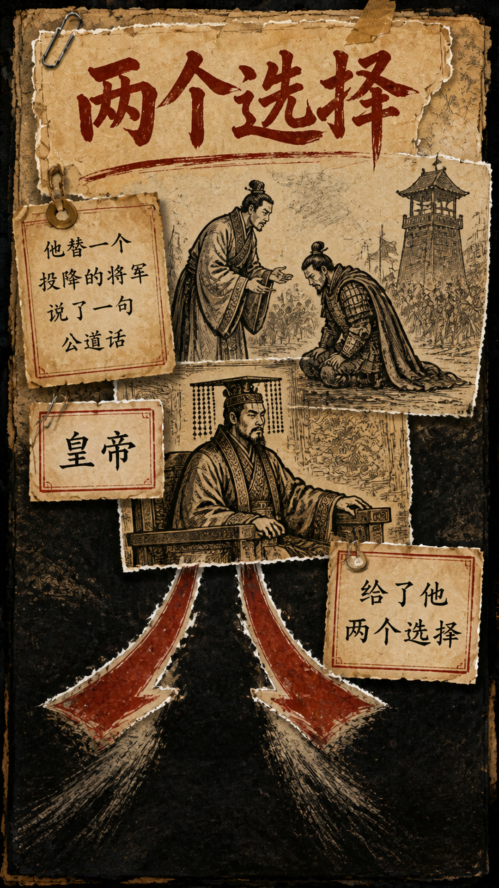

# make-static-history-video

一个给 AI Agent 使用的中文历史视频制作 Skill。

它会从选题和对标开始，带着用户依次完成写作包、完整文案、史实核查、配音、分镜、画面风格、人物母版、逐帧提示词、生图、剪辑和发布前检查。

用户负责选题、审美和最终判断；Agent 负责整理资料、生成内容、推进流程和检查结果。

> 这不是“一句话自动出片”的软件。它是一套可以恢复进度、保留确认门、减少整批返工的 Agent 工作方法。

## 看看实际画面

| 暖色宣纸 Vox | 美漫 Vox | 知识卡片 | 内容生长式齐白石写意 |
|---|---|---|---|
| <a href="examples/images/warm-xuan-vox.png"></a> | <a href="examples/images/american-comic-vox.png"></a> | <a href="examples/images/knowledge-card.png"></a> | <a href="examples/images/qibaishi-xieyi.png"></a> |

以上来自不同集数与风格测试，每个项目只采用一种风格。点击图片查看原图。

**[查看完整实例：台词 → 分镜 → 提示词 → 人物母版 → 画面检查](examples/README.md)**，含 8 张实际产物、可检查的 JSON 节选和 3 个任务用法。

## 新项目复用与结项

从这里开始：[可复用生产 SOP](references/reusable-production-sop.md)。涵盖新项目启动、阶段交付、费用台账、失败恢复、定向返工、版本核验和结项。

- [新项目 brief 模板](assets/project-templates/brief.md)：题目、受众、素材、生产选择和待定事项。
- [项目结项模板](assets/project-templates/production-review.md)：成片身份、验收证据、成本、失败修复与下一次改进。
- 初始化会自动复制两份模板；`--guided` 保持生产选择未确认，不继承环境中其他项目的音色或模型。
- 新增配音 alignment 完整性检查，识别文本错配、时间异常及零时长尾部；技术检查不能替代完整听审。
- 可选 JPEG 工作图工具保留原图和 canonical PNG，按哈希更新缓存。

复用流程、模板和工具；新项目重新建立人物、内容、音色、预算与授权。其他领域的解说可迁移流程，但需重新建立领域事实核查和视觉合同。

## 适合什么内容

- 中文历史故事与人物解说
- 竖屏静态信息图视频
- 需要多张画面保持人物一致的连续叙事
- 需要把文案、配音、字幕和镜头准确对齐的项目
- 已经做到一半，需要让 Agent 从正确位置继续的旧项目

正篇默认使用 9:16 竖屏。用户明确指定时，也支持 16:9 横版番外。

## 它会怎样工作

```text
确定选题和平台
  → 选择并拆解对标
  → 建立写作包
  → 完成文案与史实核查
  → 确认配音和画面风格
  → 根据最终配音拆分镜
  → 为主要人物建立母版
  → 为每张分镜生成独立提示词
  → 先测试最难的画面
  → 批量生图并定向修复问题帧
  → 生成字幕和镜头时间线
  → 合成候选视频并完成检查
  → 用户确认后再进入正式文件
```

每次继续项目时，Agent 只需要告诉用户五件事：

1. 现在进行到哪里。
2. Agent 接下来会做什么。
3. 用户现在只需要确认什么。
4. 这一步完成后会交付什么。
5. 确认以后进入哪一步。

## 四种固定画面风格

- `warm-xuan-vox`：暖色宣纸、撕纸拼贴、旧地图和木刻线条。
- `american-comic-vox`：粗重炭黑轮廓、网点印刷和大色块。
- `knowledge-card`：历史百科知识卡片、地图、时间轴和准确中文讲解。
- `qibaishi-xieyi`：从当前内容生长画面，用齐白石式写意组织笔墨和留白。

同一条视频只选择一种风格，不混搭。

## 人物一致性

反复出现的主要人物在批量生图前，必须先建立：

- 人物卡
- 正面或半身母版
- 全身母版

母版锁定年龄、性别、脸型、发式、身形和服饰时代，但不锁死表情、动作、景别和构图。

## 减少废图的方法

每张分镜使用独立提示词。Agent 会在付费生成前检查：

- 抽象台词是否已经变成可以直接看见的动作。
- 人物、动作发起者、目标和方向是否清楚。
- 服饰、器物、建筑和地理是否符合时代。
- 竹简、旗帜、牌匾等表面是否可能产生乱码。
- 模型最可能把当前画面误解成什么。
- 每个否定限制是否都有明确的正确替代画面。

正式批量前，先测试开场钩子、主要人物、复杂关系和高风险文字等三到五张困难画面。发现问题时只重做当前帧，不把整批图片推倒重来。

## 配音和时间线

当前内置脚本默认使用 ElevenLabs，并取得字符级时间信息。最终配音会同时决定字幕和镜头时间线。

如果接入豆包或其他配音服务，也必须取得可靠的字级或词级时间信息，并通过同样的完整听审。不能用旧字幕时间码拼接新音色，也不能手工猜测镜头长度。

## 安装

### 直接让 Agent 安装

把这个仓库地址发给支持 Skill 的 Agent，并告诉它：

```text
请安装这个 Skill：
https://github.com/snailzsh/make-static-history-video

安装完成后检查 SKILL.md、references、scripts 和 tests 是否完整。
```

### Codex 手动安装

```bash
mkdir -p ~/.codex/skills
git clone https://github.com/snailzsh/make-static-history-video.git \
  ~/.codex/skills/make-static-history-video
```

已经安装过时：

```bash
git -C ~/.codex/skills/make-static-history-video pull --ff-only
```

安装或更新后，新开一个任务，让 Agent 重新发现 Skill。

## 如何开始使用

安装完成后，把下面这段话发给 Agent：

```text
用 $make-static-history-video 开一个新历史解说项目。
主题是【主题】，观众是【受众】，平台是【平台】，素材在【路径或链接】。
先完成 brief、脚本与事实核查、生产合同、分镜和费用预览。
已有授权范围内连续推进，缺少影响目标、成本或验收的信息时集中提出。
主要人物先做母版，正式批量前先测试困难画面。
未批准前不付费生成，候选经检查和我确认后才晋级正式文件。
```

如果已经有选题，可以继续补充：

```text
这次的主题是：［填写选题］
发布平台是：［抖音 / 视频号 / 小红书］
大概时长是：［填写时长］
```

## 运行环境

- Python 3.11 或更高版本
- Node.js 20 或更高版本
- FFmpeg 与 FFprobe
- 可用的中文字体
- APIMart API Key
- ElevenLabs API Key

```bash
python3 -m pip install -r requirements.txt
```

API Key 只通过环境变量提供，不要写入项目文件、日志或截图：

```bash
export APIMART_API_KEY="你的 APIMart API Key"
export ELEVENLABS_API_KEY="你的 ElevenLabs API Key"
```

## 主要检查项

- 人物、年代、地理、制度和事件因果。
- 人物身份、服饰、器物、方向和图中文字。
- 配音断字、漏字、异常换气、音色跳变和重叠。
- 字幕与镜头是否来自同一条最终配音。
- 每一个画面切点、黑帧、长静音、编码和响度。

所有生成结果先进入候选目录。只有检查通过并得到用户确认后，才允许进入正式文件。

## 仓库结构

```text
SKILL.md                 Skill 入口和完整工作流
agents/                  Agent 展示信息
references/              项目、人物、提示词、声音和发布规范
scripts/                 可重复执行的制作与检查脚本
tests/                   项目导航、人物母版和提示词预检测试
examples/                实际图片、分镜拆解、人物母版与文字计划示例
assets/remotion-template 静态视频合成模板
assets/project-templates 新项目 brief 与结项模板
```

## 本地验证

安装依赖后，在仓库根目录运行。以下测试不调用付费接口，也不代表真实视频已完成内容或听审验收。

```bash
python3 -m unittest discover -s tests -v
python3 -m unittest discover -s scripts -p 'test_*.py' -v
```

## 安全边界

- 不提交任何 API Key、`.env`、真实账号信息或私人项目素材。
- 不在脚本和史实未确认前自动进入付费批量生成。
- 不用旧图代替新分镜，不用后期叠字掩盖生图错误。
- 不把“生成完成”当成“检查通过”或“已经发布”。
- 不经用户确认覆盖正式成片。
