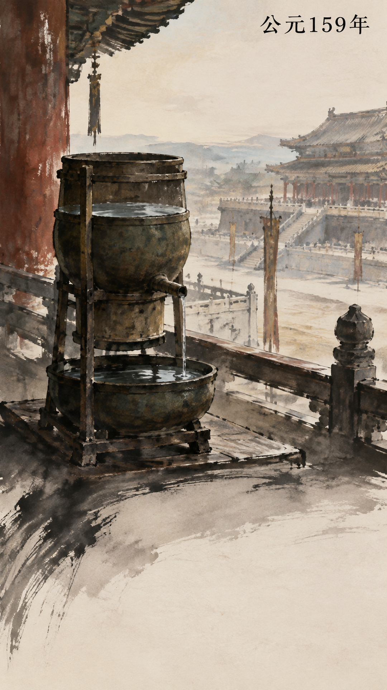
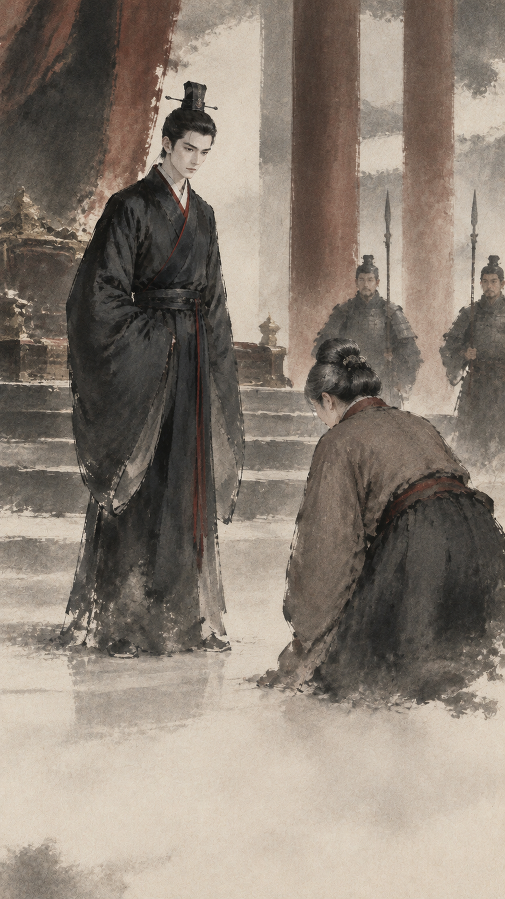
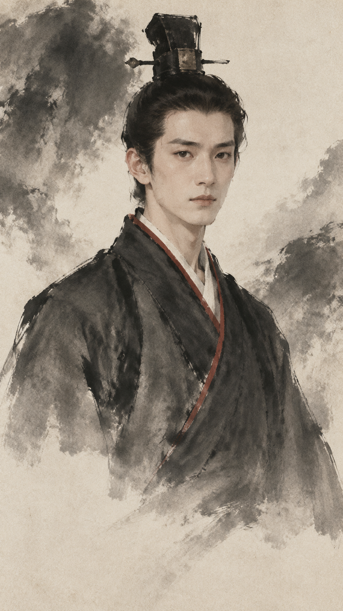
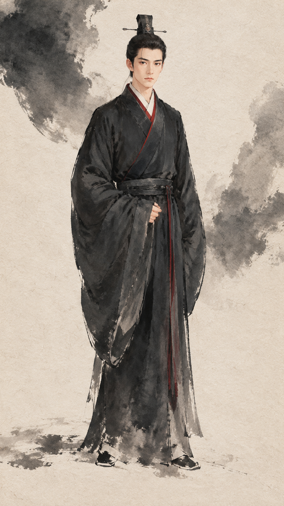

# 实例与图片

这里收录《两汉风云》项目及风格测试中实际生成的 8 张图片，展示画风、台词拆分、人物母版和文字规划。图片保留 1080×1920 原文件，可以点击查看细节。

[返回首页](../README.md) · [完整生产 SOP](../references/reusable-production-sop.md) · [结构化提示词实例](frame-prompts.example.json) · [图片来源与哈希](gallery-manifest.json)

## 四种画风，分别适合怎样的信息

以下样图来自不同集数或测试项目；每个生产项目仍只选择一种画风。

| 暖色宣纸 Vox | 美漫 Vox | 知识卡片 | 内容生长式齐白石写意 |
|---|---|---|---|
| <a href="images/warm-xuan-vox.png"></a> | <a href="images/american-comic-vox.png"></a> | <a href="images/knowledge-card.png"></a> | <a href="images/qibaishi-xieyi.png"></a> |
| `warm-xuan-vox` | `american-comic-vox` | `knowledge-card` | `qibaishi-xieyi` |
| 观察纸纤维、撕边、木刻线条和土色层次。 | 观察青蓝与朱红、粗轮廓、网点和前后人物关系。 | 观察主标题、叙事画面和说明卡的阅读顺序。 | 观察人物关系、笔墨、空间距离与底部留白。 |

这些是 AI 生成的历史编辑插画。角色外貌属于生产设计；单图用于展示制作方法，完整视频另需史实、听审、时轴和媒体 QA。

## 实例一：把台词拆成可以画出的动作

从第 42 集选出第 1、3、12 帧，分别承担“建立时间感”“引出人物”“交代消息传递”三个任务。

| 时间与场所 | 人物动作 | 关系与消息 |
|---|---|---|
| <a href="images/scene-water-clock.png"></a> | <a href="images/qibaishi-xieyi.png"></a> | <a href="images/scene-report-to-emperor.png"></a> |
| `S42-F001` | `S42-F003` | `S42-F012` |

| 项目 | F001 | F003 | F012 |
|---|---|---|---|
| 原脚本节选 | “洛阳南宫，那只漏刻，水已经落到了一半多一点。” | “二十七岁的皇帝站起身，说要去如厕。他只叫了一个小黄门跟着，叫唐衡。” | “邓贵人的母亲连夜进宫，把这件事告诉了皇帝。” |
| 核心画面 | 漏壶与可见水位，宫城交代场所 | 年轻皇帝起身，唐衡在身后跟随 | 妇人面对皇帝报告 |
| 本帧承担的信息 | 时间在流逝 | 两人即将私下交谈 | 消息进入皇帝视野 |
| 图中文字白名单 | `公元159年` | `唐衡` | 无 |
| 重点检查 | 标签准确，漏壶成为视觉焦点 | 人数与前后关系、人物身份和标签 | 说话对象与视线关系、主角身份连续 |

原脚本是叙事输入，表中的“本帧承担的信息”和检查重点为教学整理。新题材应换成自己的资料和台词；这三张选帧的时间不应直接复制到新视频。

### 从 F003 提炼一份提示词

下面是便于阅读的写法；完整生产字段节选见 [frame-prompts.example.json](frame-prompts.example.json)。

```text
叙事目标：让观众看见皇帝起身离席，只带唐衡跟随。
可见场景：东汉宫室内，年轻皇帝在前，中年宦官在后。
核心动作：起身离席，跟随关系清楚。
人物身份：引用当前项目已确认的桓帝与唐衡人物卡和母版。
唯一图中文字：唐衡。
时代约束：汉式交领袍、冠幘、束髻、席地低案、木构宫室。
构图：原生 9:16，主要人物处于画面中上部，底部保持低细节。
易误画处：把场景说明画成文字，或把多个时刻拼成一张图。
表面要求：白名单外的纸面、墙面、木牍等只呈现连续材质。
```

这个实例把“意义”“场景”“动作”“身份”“文字”分开描述，便于定位错误。若人物错了，回到身份与母版；若出现伪字，回到文字白名单和表面说明；若动作不清，先重写场景。

可运行以下预检，查看结构化字段编译后的提示词；不会调用生图接口：

```bash
python3 scripts/validate_frame_prompts.py examples/frame-prompts.example.json
```

此 JSON 是单帧字段节选，未携带付费批准和完整人物依赖。新项目需建立自己的合同、人物清单与母版，再进入实际生成。

## 实例二：人物母版怎样进入不同场景

同一个 `C-HUANDI` 先建立脸部、全身两张母版，随后用于不同台词的场景。下面展示本项目实际使用的两张母版和两张场景。

| 脸部母版 | 全身母版 | 场景：起身离席 | 场景：听取报告 |
|---|---|---|---|
| <a href="images/character-face.png"></a> | <a href="images/character-full-body.png"></a> | <a href="images/qibaishi-xieyi.png"></a> | <a href="images/scene-report-to-emperor.png"></a> |

人物卡中的生产设计节选：

> 清瘦青年，长椭圆脸，直眉，无须；汉式深墨交领袍，窄朱领缘，束髻冠幘，动作略拘谨。

| 要稳定的部分 | 随台词变化的部分 |
|---|---|
| 年龄区间、脸型、眉形、须发 | 表情、视线、动作 |
| 身形、发式、服装轮廓与稳定色彩 | 景别、机位、人物位置 |
| 角色 ID 与母版来源 | 场景道具、空间距离、留白 |

两张场景里的皇帝保持深色长袍与朱红领缘，但动作和对话对象变化。检查时同时看身份是否漂移、构图是否只是重复母版。其他人物也要按出场频率和辨识需要建立自己的连续性等级。

新项目复用的是人物卡和母版机制；具体角色的外貌、服饰与母版需要重新建立。

## 实例三：知识卡片先规划每个文字容器

<a href="images/knowledge-card.png"></a>

这张图对应的生产 `text_plan` 有四项：

| 容器 | 必须出现的文字 | 作用 |
|---|---|---|
| 主标题 | 两个选择 | 第一眼读到核心问题 |
| 叙事说明卡 | 他替一个投降的将军说了一句公道话 | 交代事情起因 |
| 人物标签 | 皇帝 | 指认画面人物 |
| 结果说明卡 | 给了他两个选择 | 把观众引向后续内容 |

可以下载 [knowledge-card-text-plan.example.json](knowledge-card-text-plan.example.json) 查看原生产字段节选。

这类画面检查的不只是大标题。逐个比对四个容器的文字完整性、顺序与可读性，检查是否额外生成了空框、伪字或错误标签。发现错字时定向重生当前帧，并保存失败记录；不要用后期叠字盖住问题。

## 三个可以直接使用的任务例子

**从新主题开始**

```text
用 $make-static-history-video 建立一个明代漕运解说项目。
观众是普通成年人，先做一集竖屏视频，脚本未定稿。
先建立 brief、资料清单和脚本方案，再给出分镜与费用预览。
本轮不进行付费生成。
```

**从已有脚本开始**

```text
使用 $make-static-history-video。脚本位于【脚本路径】，修改范围是【范围】。
先保留原文、核查事实，再拆 shot 和 frame。
风格采用【四种预设之一】，字幕模式为【rendered 或 none】。
列出需要人物母版的角色和四类压力帧，给我具体生成数量与预算。
```

**只修复一个问题帧**

```text
使用 $make-static-history-video 修复【项目路径】中的【frame_id】。
问题是【具体错字、人物漂移或方向错误】。
先检查该帧的台词、提示词、母版和现有任务记录，给出最小修复范围。
若超出已批准的费用范围，先展示本次修复预览。
修复后更新对应资产和候选，并重新检查受影响实帧与切点。
```

## 来源与复用方式

图片取自本仓库维护者的《两汉风云》项目和风格测试，上传的是现有 canonical PNG，未裁切、未重绘。具体项目、帧号、尺寸、体积和 SHA256 见 [gallery-manifest.json](gallery-manifest.json)。

阅读示例时复用任务拆分、字段结构、检查方法和人物连续性机制。把示例图片作为新项目的生图参考前，先明确其用途与题材适配范围，避免把旧人物、年代和构图一起带入。
